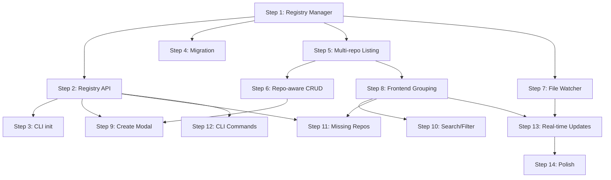

# Multi-Repo Registry - Implementation Plan

## Progress Checklist

- [ ] Step 1: Registry Manager foundation
- [ ] Step 2: Registry API endpoints
- [ ] Step 3: CLI `init` command
- [ ] Step 4: Migration to global/
- [ ] Step 5: Multi-repo diagram listing
- [ ] Step 6: Repo-aware diagram CRUD
- [ ] Step 7: File watcher setup
- [ ] Step 8: Frontend repo grouping
- [ ] Step 9: Create diagram with repo selection
- [ ] Step 10: Search/filter and collapse
- [ ] Step 11: Missing repo handling
- [ ] Step 12: CLI remaining commands
- [ ] Step 13: Real-time UI updates
- [ ] Step 14: Polish and documentation

---

## Step 1: Registry Manager Foundation

**Objective**: Create the core registry manager module that handles loading, saving, and manipulating the registry file.

**Implementation guidance**:
- Create `server/registry.js` with ES module exports
- Implement atomic write-and-rename pattern for safety
- Handle missing registry file by creating empty one
- Use `os.homedir()` for `~/.aligner/` path

**Test requirements**:
- Unit test: Load registry from file
- Unit test: Save registry with atomic write
- Unit test: Handle missing registry file
- Unit test: Handle corrupt JSON gracefully

**Integration with previous work**: N/A - foundation step

**Demo**: Run test suite showing registry can be loaded/saved. Manually verify `~/.aligner/registry.json` is created when missing.

---

## Step 2: Registry API Endpoints

**Objective**: Add REST endpoints for listing and managing registered repos.

**Implementation guidance**:
- Add `GET /repos` - returns list of repos with status (ok/missing)
- Add `POST /repos/register` - register a new repo
- Add `DELETE /repos/:encodedPath` - unregister a repo
- Add `PATCH /repos/:encodedPath` - update repo name
- Use `encodeURIComponent`/`decodeURIComponent` for paths in URLs

**Test requirements**:
- Integration test: GET /repos returns empty array initially
- Integration test: POST /repos/register adds repo
- Integration test: POST /repos/register is idempotent
- Integration test: DELETE removes repo
- Integration test: PATCH updates name

**Integration with previous work**: Uses registry manager from Step 1

**Demo**: Use curl or Postman to register a repo, list repos, update name, and unregister. Show registry.json updates correctly.

---

## Step 3: CLI `init` Command

**Objective**: Implement `aligner init` to create `.aligner/` directory and register the repo.

**Implementation guidance**:
- Add `init` case to `bin/aligner` bash script
- Create `.aligner/` directory in CWD if missing
- Call `POST /repos/register` API (server must be running) OR write directly to registry
- Support `--name` flag for custom display name
- Make idempotent - safe to run multiple times

**Test requirements**:
- E2E test: `aligner init` creates `.aligner/` directory
- E2E test: `aligner init` adds repo to registry
- E2E test: Running twice is idempotent
- E2E test: `--name` flag sets custom name

**Integration with previous work**: Uses API from Step 2, or writes registry directly

**Demo**: Run `aligner init` in a test directory. Show `.aligner/` created and repo appears in registry.json. Run again to show idempotent behavior.

---

## Step 4: Migration to Global

**Objective**: On server startup, migrate existing diagrams from `~/.aligner/*.json` to `~/.aligner/global/`.

**Implementation guidance**:
- Create `server/migration.js` module
- On startup, check for `.json` files in `~/.aligner/` (not in subdirectories)
- Move them to `~/.aligner/global/` (create directory if needed)
- Skip `registry.json`
- Log migration activity

**Test requirements**:
- Unit test: Migration moves files correctly
- Unit test: Migration skips registry.json
- Unit test: Migration creates global/ if needed
- Unit test: Migration is idempotent (doesn't fail if already migrated)

**Integration with previous work**: Called during server startup, before watcher setup

**Demo**: Place a test diagram in `~/.aligner/`, start server, verify it moves to `~/.aligner/global/`.

---

## Step 5: Multi-Repo Diagram Listing

**Objective**: Update `GET /diagrams` to return diagrams from all registered repos plus global.

**Implementation guidance**:
- Read registry to get repo list
- Scan each repo's `.aligner/` directory
- Always include `~/.aligner/global/`
- Add `repo` (display name) and `repoPath` fields to response
- Handle missing repos gracefully (skip, don't error)

**Test requirements**:
- Integration test: Returns diagrams from multiple repos
- Integration test: Includes global diagrams
- Integration test: Skips missing repos without error
- Integration test: Response includes repo metadata

**Integration with previous work**: Uses registry from Steps 1-2

**Demo**: Register two repos with diagrams, call `GET /diagrams`, show aggregated list with repo context.

---

## Step 6: Repo-Aware Diagram CRUD

**Objective**: Update diagram endpoints to support repo context in URLs.

**Implementation guidance**:
- Change routes from `/diagram/:filename` to `/diagram/:repo/:filename`
- `:repo` is URL-encoded path or literal "global"
- Create helper function `resolveDiagramPath(repo, filename)`
- Update GET, PUT, POST, DELETE endpoints
- Maintain backward compatibility temporarily (redirect old URLs)

**Test requirements**:
- Integration test: GET diagram from specific repo
- Integration test: PUT diagram to specific repo
- Integration test: POST creates diagram in specific repo
- Integration test: DELETE removes from specific repo
- Integration test: "global" keyword works

**Integration with previous work**: Uses path resolution, builds on Step 5

**Demo**: Create a diagram in a registered repo via API, verify file appears in `repo/.aligner/`. Read it back with repo context.

---

## Step 7: File Watcher Setup

**Objective**: Watch all registered `.aligner/` directories for changes using chokidar.

**Implementation guidance**:
- Create `server/watcher.js` module
- Initialize chokidar with all repo paths + global
- Use options: `depth: 0`, `ignoreInitial: true`, `awaitWriteFinish`
- Emit events for add/change/unlink
- Provide methods to add/remove watched paths

**Test requirements**:
- Unit test: Watcher detects new file
- Unit test: Watcher detects modified file
- Unit test: Watcher detects deleted file
- Unit test: Adding new path to watcher works

**Integration with previous work**: Uses registry to get initial paths

**Demo**: Start server, manually create a file in `.aligner/` directory, show server logs the change.

---

## Step 8: Frontend Repo Grouping

**Objective**: Update sidebar to group diagrams by repo with collapsible sections.

**Implementation guidance**:
- Create `src/components/RepoSidebar.tsx` component
- Group diagrams by `repo` field from API response
- Use collapsible sections (Framer Motion for animation)
- Show repo name as section header with folder icon
- Global section always visible at bottom

**Test requirements**:
- Component renders repo groups correctly
- Clicking header toggles collapse
- Diagrams appear under correct repo
- Global section renders separately

**Integration with previous work**: Consumes updated `/diagrams` API from Step 5

**Demo**: Start Aligner with multiple registered repos, show sidebar with grouped diagrams. Click to collapse/expand repos.

---

## Step 9: Create Diagram with Repo Selection

**Objective**: Add modal for creating diagrams with repo selection, pre-selected based on context.

**Implementation guidance**:
- Create `src/components/CreateDiagramModal.tsx`
- Fetch repos from `GET /repos` for dropdown
- Pre-select based on startup context (pass via query param or config)
- Include "Global" option
- On submit, call `POST /diagram/:repo` with selected repo

**Test requirements**:
- Modal shows all repos plus Global
- Pre-selection works when context provided
- Creating diagram saves to correct repo
- Modal closes on success

**Integration with previous work**: Uses `/repos` API, repo-aware POST from Step 6

**Demo**: Click "New Diagram", show repo dropdown with pre-selection, create diagram, verify it appears in correct repo's `.aligner/` directory.

---

## Step 10: Search/Filter and Collapse

**Objective**: Add search box to filter diagrams and default repos to collapsed state.

**Implementation guidance**:
- Add filter input above repo list in sidebar
- Filter matches diagram name OR repo name
- Store collapsed state per repo in component state
- Default all repos to collapsed on initial load
- Expand repo automatically if it contains filtered match

**Test requirements**:
- Filter narrows visible diagrams
- Filter searches across all repos
- Collapsed state persists during session
- Matching repo auto-expands when filtering

**Integration with previous work**: Enhances RepoSidebar from Step 8

**Demo**: With multiple repos, type in filter box, show diagrams filtering. Show repos collapsed by default, then expanded on demand.

---

## Step 11: Missing Repo Handling

**Objective**: Display warning for repos that can't be found and allow resolution.

**Implementation guidance**:
- `/repos` API already returns `missing` array
- Show missing repos grayed out with warning icon
- On click, show options: "Locate" or "Remove"
- "Locate" opens file picker (or prompts for path)
- "Remove" calls `DELETE /repos/:encodedPath`

**Test requirements**:
- Missing repo shows warning indicator
- Clicking shows resolution options
- Remove option unregisters repo
- Locate updates registry with new path

**Integration with previous work**: Uses `/repos` API response, PATCH endpoint for locate

**Demo**: Register a repo, move/rename the folder, restart Aligner, show warning. Click to remove from registry.

---

## Step 12: CLI Remaining Commands

**Objective**: Implement `aligner unregister` and `aligner repos` commands.

**Implementation guidance**:
- `aligner unregister` - remove CWD from registry
- `aligner repos` - list all registered repos with status
- Update `aligner list` to show diagrams grouped by repo

**Test requirements**:
- E2E test: `unregister` removes repo
- E2E test: `repos` lists all repos
- E2E test: `list` shows grouped output

**Integration with previous work**: Uses registry APIs

**Demo**: Run `aligner repos` to see list. Run `aligner unregister` in a registered repo, verify it's removed.

---

## Step 13: Real-Time UI Updates

**Objective**: Connect file watcher events to frontend for live updates.

**Implementation guidance**:
- Add WebSocket or Server-Sent Events endpoint
- Watcher emits events to connected clients
- Frontend subscribes on mount
- On event, refetch diagram list (or apply incremental update)
- Handle currently-open diagram changes (prompt or auto-reload)

**Test requirements**:
- Adding file triggers sidebar update
- Modifying file updates list
- Deleting file removes from sidebar
- Open diagram shows refresh prompt if changed externally

**Integration with previous work**: Uses watcher from Step 7, updates UI from Step 8

**Demo**: Open Aligner, manually add a diagram file to `.aligner/` via terminal, show it appears in sidebar without refresh.

---

## Step 14: Polish and Documentation

**Objective**: Final polish, error handling, and documentation updates.

**Implementation guidance**:
- Review all error messages for clarity
- Add loading states to UI
- Update README with multi-repo feature docs
- Add `aligner help` output for new commands
- Verify all edge cases handled

**Test requirements**:
- Full E2E test of complete workflow
- Error scenarios handled gracefully
- Documentation accurate

**Integration with previous work**: Touches all previous steps

**Demo**: Complete walkthrough: `aligner init` in new repo, create diagrams in UI, show grouping, register second repo, show aggregation, filter, real-time updates.

---

## Dependencies Between Steps

## Notes

- Steps 1-4 are backend foundation
- Steps 5-7 complete backend features
- Steps 8-11 are frontend
- Steps 12-14 are finishing touches
- Each step produces working, testable increment
